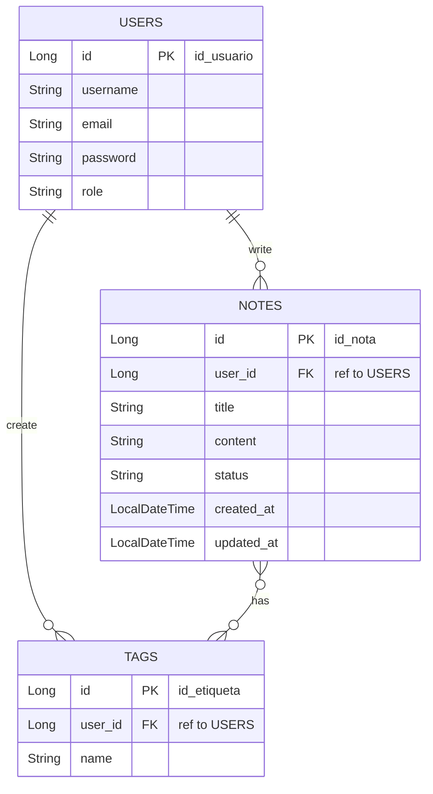
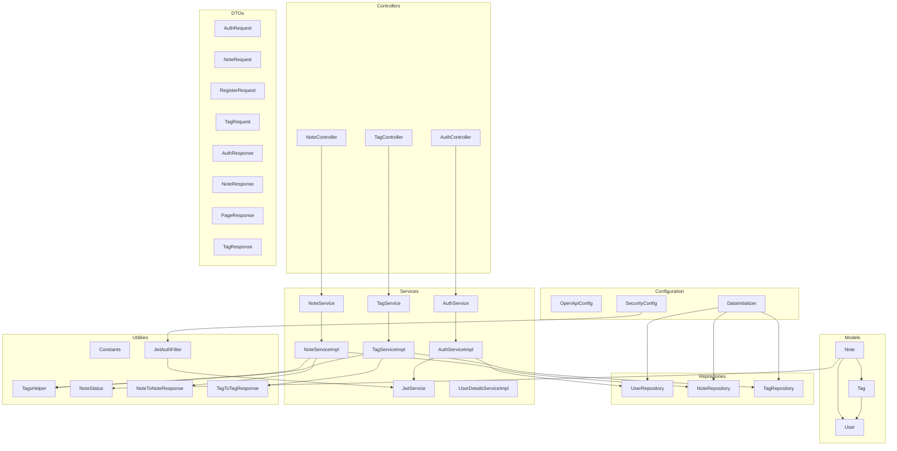

# Notes API Documentation

# 📄 Project Summary

This project is the backend for an application to create notes with tags by user, developed using Spring Boot 3.5.5.
It exposes a RESTful API to manage.
- Notes: Create, Read, Update, Delete (CRUD) operations for notes.
- Tags: Create, Read, Update, Delete (CRUD) operations for tags.
- Users: Register and Login.

## 🛠️ Technologies Used
- Java 21+
- Spring Boot 3.5.5
- Maven
- Spring Data JPA
- Hibernate
- h2da Database:
- OpenAPI 3.1 (Swagger)

## 🌐 API Documentation
The API documentation is available at after running the application. You can access it via the following links:
- [Swagger UI](http://localhost:8080/swagger-ui/index.html)
- [OpenAPI JSON](http://localhost:8080/v3/api-docs)
- [OpenAPI YAML](http://localhost:8080/v3/api-docs.yaml)

## 📁 H2 Database
You can access it via the following links:
- [H2 Console](http://localhost:8080/h2-console)

## 🔧 Configuration
### Prerequisites
Make sure you have the following components installed:
- Java Development Kit (JDK) version 21 or higher.
- Maven.

### Installation
1. Clone the repository:
   ```bash
   git clone https://github.com/Alessandro199510/be-notes-dh.git
   ```
2. Navigate to the project directory:
   ```bash
   cd notes-api
   ```
3. Build the project using Maven:
    ```bash
    mvn clean install
    ```
4. Run the application:
   ```bash
    mvn spring-boot:run
    ```
5. The application will start on `http://localhost:8080`.

# DataBase Diagram


# Diagram components
